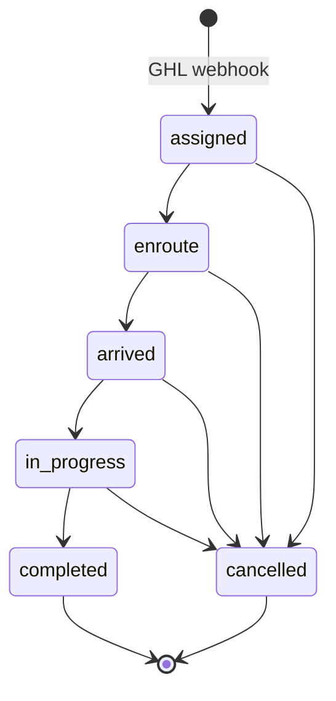

# Architecture

## High-Level Structure

The system is composed of three main parts:

```
┌─────────────────────────────────────────────┐
│           Crew / Admin Browser               │
│         React PWA (Vite + Workbox)           │
└────────────────────┬────────────────────────┘
                     │ HTTPS (JWT Bearer)
┌────────────────────▼────────────────────────┐
│           Node.js / Express API              │
│   /auth  /jobs  /admin  /notifications       │
│   /webhooks (raw body, Ed25519 verified)     │
└──────┬─────────────┬────────────────────────┘
       │             │
┌──────▼──────┐  ┌───▼───────────────────────┐
│  Supabase   │  │     GHL API               │
│ (Postgres   │  │  (via n8n OAuth tokens)   │
│  + Storage) │  └───────────────────────────┘
└─────────────┘
```

---

## Backend

**Runtime:** Node.js ≥ 18, Express 4

### Route Layout

All routes are registered under `/api` via `src/routes/index.js`:

| Prefix | Purpose |
|---|---|
| `/api/auth` | Login, OTP, PIN setup |
| `/api/jobs` | Crew job list, job detail, status updates, photos, locations, timesheets, invoices |
| `/api/admin` | Admin-only operations — pipelines, crew, sync, settings |
| `/api/notifications` | VAPID key + push subscription management |
| `/api/webhooks/ghl` | GHL inbound webhook (registered before `express.json()` to preserve raw body) |

### Middleware Stack

1. **CORS** — origin restricted to `FRONTEND_URL` env var
2. **Raw body capture** — runs before `express.json()` for the `/webhooks` route only; required for Ed25519 signature verification
3. **`express.json()`** — parses JSON for all other routes
4. **`requireAuth`** — verifies JWT Bearer token; attaches `req.user` (`{ userId, phone, role, locationId }`)
5. **`requireAdmin`** — checks `req.user.role === 'admin'`; used on top of `requireAuth` for admin routes
6. **`errorHandler`** — global uncaught error handler; returns 500 in JSON

### Controller Layout

| File | Responsibility |
|---|---|
| `authController.js` | OTP send/verify, PIN setup/login, session token issue |
| `jobsController.js` | Job list (by crew), job detail, status transition + GHL sync |
| `invoicesController.js` | GHL invoice CRUD, estimate fetch, estimate→invoice conversion, payment recording |
| `adminController.js` | Pipelines, stages, crew management, jobs overview, sync endpoints, settings |
| `photosController.js` | Photo upload to Supabase Storage, photo list, delete |
| `timesheetController.js` | Clock-in, clock-out, break recording, timesheet fetch |
| `locationsController.js` | GPS ping storage, location list |
| `notificationController.js` | VAPID public key, subscribe/unsubscribe |

### Services

| File | Responsibility |
|---|---|
| `ghl.js` | Axios client factory with 3-stage auth fallback (OAuth → fresh OAuth → PIT) |
| `ghlTokenService.js` | OAuth token retrieval via n8n; 20-minute in-memory cache |
| `pitTokenService.js` | Private Integration Token fallback; fetched from GHL API by name |
| `ghlOutbound.js` | All outbound GHL calls + `provisionCustomFields` |
| `pushService.js` | Web Push via VAPID; `notifyUser`, `notifyAdmins`, notification settings |
| `supabase.js` | Supabase client singleton |
| `mobilemessage.js` | SMS sending via MobileMessage API |

---

## Frontend

**Runtime:** React 18, Vite 5, deployed as a static PWA

### Routing

React Router 6 with two access levels:

- **`ProtectedRoute`** — redirects unauthenticated users to `/`
- **`AdminRoute`** — additionally checks `role === 'admin'`; non-admins see an access denied message

| Path | Component | Access |
|---|---|---|
| `/` | LoginPage | Public |
| `/dashboard` | DashboardPage | Authenticated |
| `/jobs/:id` | JobDetailPage | Authenticated |
| `/jobs/:id/create-invoice` | CreateInvoicePage | Authenticated |
| `/profile` | ProfilePage | Authenticated |
| `/admin` | AdminDashboardPage | Admin only |
| `/admin/pipeline` | PipelineSetupPage | Admin only |
| `/admin/stages` | StageMappingPage | Admin only |
| `/admin/crew` | CrewManagementPage | Admin only |
| `/admin/jobs` | AdminJobsPage | Admin only |
| `/admin/invoice-settings` | AdminInvoiceSettingsPage | Admin only |
| `/admin/notification-settings` | AdminNotificationSettingsPage | Admin only |
| `/admin/crew-map` | CrewMapPage | Admin only |
| `/admin/billing-rules` | AdminBillingRulesPage | Admin only |

### State Management

**Zustand** with `persist` middleware (localStorage key: `mh-auth`).

The auth store holds `{ user, token, timezone, isAuthenticated }`. On login, the token is also written to `localStorage` under the key `mh_token` so the Axios request interceptor can attach it without importing Zustand.

### API Communication

Two Axios instances:

- `src/services/api.js` — crew-accessible endpoints; attaches JWT from `localStorage.mh_token`; auto-redirects to `/` on 401
- `src/services/adminApi.js` — admin-only endpoints; same auth pattern

### PWA / Service Worker

`src/sw-custom.js` compiled via Vite Plugin PWA (injectManifest mode):

- **Precache:** all static assets at build time (Workbox manifest)
- **Runtime cache — NetworkFirst:** job list, individual jobs, all other `/api/*` routes (10s network timeout, 24h max age)
- **Runtime cache — CacheFirst:** images (7-day max age)
- **Navigation fallback:** serves `index.html` from precache for all SPA routes
- **Push handler:** displays notifications received from the server; clicking navigates to the URL in the notification payload
- **Auto-update:** new SW versions call `skipWaiting()` immediately; a banner prompts the user to reload

### Offline Queue

`src/utils/offlineQueue.js` + `src/hooks/useSyncQueue.js` implement a write-ahead queue stored in `localStorage`. Mutations that fail while offline are queued and replayed automatically when connectivity returns.

---

## Database (Supabase / PostgreSQL)

All tables use the `mh_pwa_` prefix. Every query is scoped by `location_id` (tenant isolation).

### Core Tables

| Table | Purpose |
|---|---|
| `mh_pwa_tenants` | One row per installed GHL sub-account. Stores company info, plan, invoice branding, notification toggles, pipeline selection. |
| `mh_pwa_crew_users` | All crew members and admins. Phone is the login identifier. Linked to GHL user via `ghl_user_id`. Soft-deletable via `is_active`. |
| `mh_pwa_jobs` | One row per GHL opportunity. Stores job details, status, customer info, addresses, scheduled date. `ghl_job_id` is the unique link to GHL. |
| `mh_pwa_job_crew_assignments` | Many-to-many join between jobs and crew. `assigned_by` distinguishes GHL-sourced assignments from manual app assignments. |
| `mh_pwa_timesheets` | Clock-in/clock-out per crew member per job. `total_minutes` is a generated column (auto-calculated). |
| `mh_pwa_job_photos` | Photo metadata. The file lives in Supabase Storage; the row stores the `storage_path` and `public_url`. |
| `mh_pwa_job_locations` | GPS snapshots. Recorded on status changes (enroute, arrived) and optionally on app open. |
| `mh_pwa_otp_tokens` | Short-lived OTP hashes. Invalidated after use or on re-send. |
| `mh_pwa_location_custom_fields` | Cache of GHL custom field UUID → key mappings per tenant. Refreshed daily. |
| `mh_pwa_pipeline_stages` | Cached GHL pipeline/stage list per tenant. Used to map job status → GHL stage. |
| `mh_pwa_ghl_sync_log` | Audit log of every inbound webhook and outbound GHL call. Stores payload, status, and error message. |
| `mh_pwa_push_subscriptions` | Web Push subscription objects per user per device. |

### Enums

| Enum | Values |
|---|---|
| `crew_role` | `crew`, `lead`, `admin` |
| `job_status` | `assigned`, `enroute`, `arrived`, `in_progress`, `completed`, `cancelled` |
| `photo_type` | `before`, `after`, `damage`, `item`, `other` |
| `location_trigger` | `app_open`, `enroute`, `arrived`, `in_transit`, `interval` |
| `sync_direction` | `inbound`, `outbound` |
| `sync_status` | `pending`, `success`, `failed` |

---

## Authentication

The system uses a two-step phone-based auth flow. There is no email/password and no Supabase Auth.

```mermaid
sequenceDiagram
    participant U as User
    participant F as Frontend
    participant B as Backend
    participant MM as MobileMessage (SMS)
    participant DB as Database

    U->>F: Enter phone number
    F->>B: POST /auth/send-otp
    B->>DB: Invalidate old OTP tokens for phone
    B->>DB: Insert new OTP hash (expires 10 min)
    B->>MM: Send SMS with OTP code
    U->>F: Enter 6-digit OTP
    F->>B: POST /auth/verify-otp
    B->>DB: Validate hash (timing-safe compare)
    B->>DB: Mark token used
    B->>DB: Fetch crew_users by phone
    B-->>F: JWT (30 days) + user + timezone + requiresPinSetup flag
    alt First login — no PIN set
        U->>F: Set 4-digit PIN
        F->>B: POST /auth/setup-pin (with JWT)
        B->>DB: Store bcrypt PIN hash
    end
    note over U,F: Returning users — OTP still required; PIN is a second factor
    U->>F: Enter phone number again
    F->>B: POST /auth/send-otp
    B->>MM: Send SMS with OTP code
    U->>F: Enter 6-digit OTP
    F->>B: POST /auth/verify-otp
    B-->>F: JWT (temporary) + requiresPinSetup: false
    U->>F: Enter 4-digit PIN
    F->>B: POST /auth/login-pin
    B->>DB: Fetch crew_users, bcrypt.compare PIN
    B-->>F: JWT (30 days) + user + timezone
```

**JWT payload:** `{ userId, phone, role, locationId }` — signed with `JWT_SECRET`, 30-day expiry.

**Security notes:**
- OTP hashed with SHA-256 before storage; compared with `crypto.timingSafeEqual`
- PIN hashed with bcrypt (12 salt rounds)
- Crew accounts are provisioned only via GHL webhooks — the backend never auto-creates accounts at login time
- A dev bypass exists: phones listed in `OTP_BYPASS_PHONES` always receive OTP `123456` without an SMS

---

## GHL Integration

### Token Management (3-Stage Fallback)

GHL OAuth tokens are managed externally by an n8n workflow. The backend fetches tokens on demand via `ghlTokenService.js` (20-minute in-memory cache). The axios client in `ghl.js` has a response interceptor with three retry stages:

```
Stage 1: 401/403 → invalidate cached OAuth token, fetch fresh token from n8n, retry
Stage 2: still 401/403 → fetch Private Integration Token (PIT) from n8n, retry
Stage 3: still failing → invalidate PIT cache, throw
```

This layered fallback means the app continues to work even if the OAuth token refresh in n8n is temporarily delayed.

### Inbound Webhooks

GHL fires webhooks to `POST /api/webhooks/ghl`. Each request is verified with an Ed25519 signature (`X-GHL-Signature` header) against the GHL app's public key.

Handled events:

| Event | Action |
|---|---|
| `INSTALL` / `AppInstall` | Register tenant; bootstrap crew, custom fields, pipeline stages |
| `UNINSTALL` / `AppUninstall` | Soft-deactivate tenant (data preserved) |
| `PLAN_CHANGE` | Update tenant plan ID |
| `LocationUpdate` | Sync company name change |
| `OpportunityCreate` | Fetch full opportunity from GHL API; upsert job |
| `OpportunityUpdate` / `OpportunityStageUpdate` | Re-fetch and upsert job |
| `OpportunityStatusUpdate` | Map GHL `won → completed`, `lost → cancelled` |
| `OpportunityAssignedToUpdate` | Update crew assignment; push notification to crew member |
| `OpportunityDelete` | Mark job cancelled |
| `UserCreate` / `UserUpdate` | Upsert crew member |
| `UserDelete` | Soft-disable crew member |

All events are logged to `mh_pwa_ghl_sync_log` with status (`pending`, `success`, `failed`).

### Outbound Calls (Fire-and-Forget)

When crew update job status, the backend makes GHL API calls asynchronously without blocking the response:

| Action | GHL API call |
|---|---|
| Job completed | PUT opportunity → `status: won` + duration/notes |
| Job cancelled | PUT opportunity → `status: lost` + cancellation reason |
| Stage sync | PUT opportunity → `pipelineId + pipelineStageId` |
| Custom field update | PUT opportunity → `customFields: [{ id, field_value }]` |
| Photo uploaded | POST contact note with photo URL |

All outbound calls use exponential backoff retry (`src/utils/retry.js`) and are logged to `mh_pwa_ghl_sync_log`.

---

## Job Status Machine

Status transitions are enforced on the backend. Only the listed transitions are permitted — any other combination returns 422.



When a job moves to `completed`, the backend also calculates duration (from `scheduled_date` to now) and pushes it to GHL.

---

## Push Notifications

Web Push via VAPID keys stored in environment variables. The service worker receives push events and shows system notifications.

Two notification channels:
- **`notifyUser(userId)`** — sends to all push subscriptions for a specific crew member (used for job assignment notifications)
- **`notifyAdmins(locationId)`** — sends to all admin users for a tenant (used for status changes, invoice events)

Notification settings are configurable per tenant in the admin panel. Expired subscriptions (HTTP 410/404 from the push service) are cleaned up automatically.

---

## Install Bootstrap

When a GHL sub-account installs the app, the following happens automatically:

1. Tenant row upserted in `mh_pwa_tenants`
2. GHL Location API called to fetch and store timezone + invoice branding
3. In parallel (with a 45-second retry in case OAuth tokens aren't ready yet):
   - All GHL users with a phone number are imported as crew members
   - Required custom fields provisioned on GHL opportunities (pickup address, dropoff address, scheduled date, moving inventory, crew notes, job status, job type)
   - All GHL pipelines and their stages fetched and cached

This means a newly installed company is fully operational within about a minute of installation, with zero manual setup required for the basic data import.
