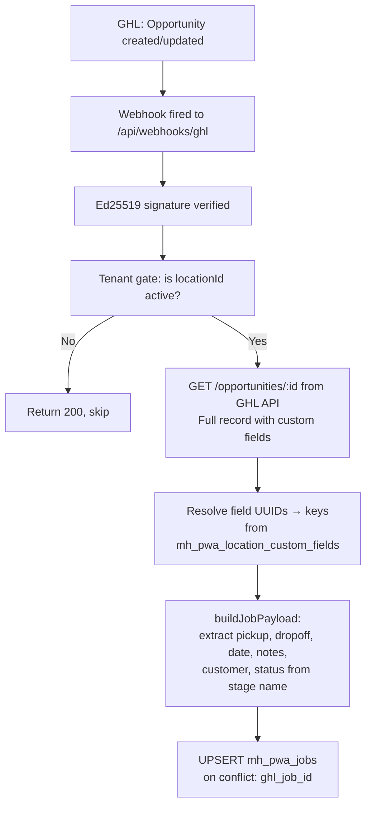
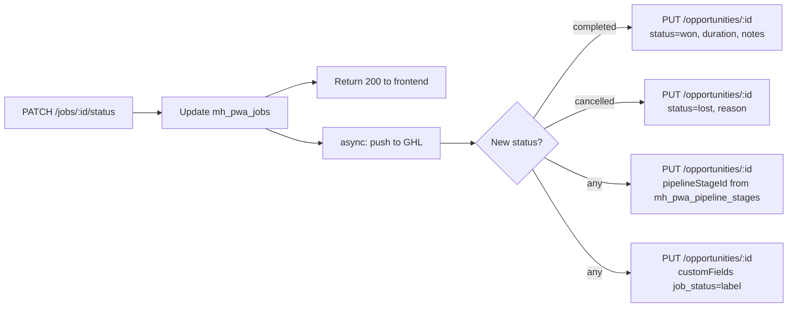
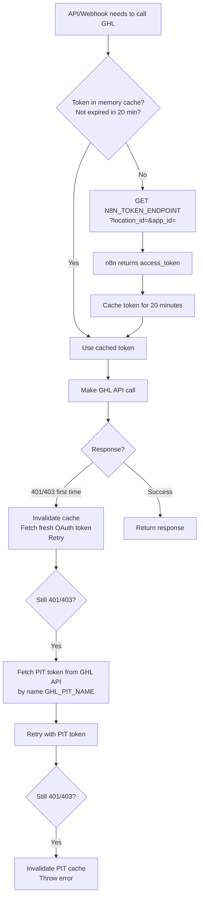
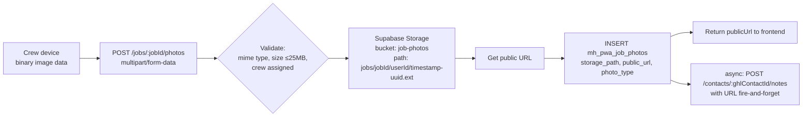
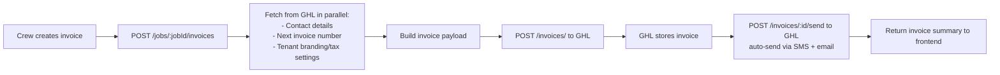

# Data Flow

This document explains how data enters, moves through, and leaves the system. It traces each major data type from its origin to its final destination.

---

## Overview

Data moves through the system in two directions:

- **Inbound:** GHL → Webhook Handler → Database → Frontend
- **Outbound:** Frontend → API → Database → GHL

```mermaid
flowchart LR
    GHL[GHL CRM]
    WH[Webhook Handler]
    API[Express API]
    DB[(Supabase\nPostgres)]
    ST[(Supabase\nStorage)]
    FE[React PWA]
    N8N[n8n\nToken Service]

    GHL -- webhooks --> WH
    WH <-- OAuth tokens --- N8N
    WH <-- full opportunity --> GHL
    WH --> DB
    API --> DB
    API --> ST
    API <-- OAuth tokens --- N8N
    API <-- GHL API calls --> GHL
    FE -- JWT Bearer --> API
    FE <-- JSON responses --- API
```

---

## 1. Tenant Data

### How it enters
A company installs the app → GHL fires `INSTALL` webhook → webhook handler upserts one row into `mh_pwa_tenants`.

### What is stored

| Field | Source |
|---|---|
| `location_id` | GHL webhook body (`body.locationId`) — primary key |
| `company_name` | GHL webhook body (`body.companyName`) |
| `plan_id` | GHL webhook body (`body.planId`) |
| `is_active` | Set `true` on install, `false` on uninstall |
| `timezone` | Fetched from `GET /locations/:id` after install |
| `invoice_business_*` | Fetched from `GET /locations/:id` after install |
| `notif_*` | Defaults `true`, updated via admin panel |
| `pipeline_id` | Set by admin via admin panel |

### How it updates
- `LocationUpdate` webhook updates `company_name`
- `PLAN_CHANGE` webhook updates `plan_id`
- Admin panel updates invoice settings, notification toggles, pipeline selection

### How it's used
Every request that touches the database uses the `location_id` from the JWT payload (`req.user.locationId`) to scope all queries. No query returns data across tenants.

---

## 2. Crew Member Data

### How it enters
- **At install:** all GHL users with a phone number are bulk-imported via `GET /users/?locationId=`
- **Ongoing:** `UserCreate` and `UserUpdate` webhooks upsert individual crew members
- **On conflict (phone duplicate):** the webhook handler patches the existing row by phone number and attaches the `ghl_user_id`

### What is stored

| Field | Source |
|---|---|
| `phone` | GHL user record — login identifier |
| `full_name` | GHL `firstName + lastName` |
| `ghl_user_id` | GHL user ID — used to match webhook assignments |
| `role` | Mapped from GHL role: `admin` role → `admin`, otherwise → `crew` |
| `pin_hash` | bcrypt hash of the 4-digit PIN set by the crew member at first login |
| `location_id` | GHL `locationId` from webhook body |
| `is_active` | `true` by default; set `false` by `UserDelete` webhook |

### How it flows to the user
On login (`POST /auth/login-pin` or `POST /auth/verify-otp`):
1. Backend fetches crew user by phone from `mh_pwa_crew_users`
2. Returns `publicUser(crewUser)` — all fields except `pin_hash`
3. Frontend stores in Zustand auth store + localStorage

---

## 3. Job Data

Jobs are the most frequently flowing data type in the system.

### Inbound path (GHL → App)



**Custom field resolution detail:**
- GHL webhooks only carry scalar fields, not custom fields
- The handler fetches the full opportunity from GHL API
- Custom fields arrive as `[{ id: "uuid", fieldValue: "..." }]`
- The UUID is resolved to a human-readable key using `mh_pwa_location_custom_fields`
- This map is refreshed from GHL API daily (or when the `FIELD_DEF_REFRESH_DAYS` threshold is exceeded)

**Stage → Status mapping:**
- The opportunity's `stage.name` is looked up in `mh_pwa_pipeline_stages` via `STAGE_STATUS_MAP`
- If the stage maps to a known job status (`assigned`, `enroute`, etc.), the job status is set
- If no mapping exists, the status is left unchanged (never overwritten with null)

### Outbound path (App → GHL)

Status changes trigger fire-and-forget GHL API calls. These never block the user-facing response.



### Job fields stored locally

| Field | Source |
|---|---|
| `ghl_job_id` | GHL opportunity ID — foreign key link |
| `ghl_contact_id` | GHL contact ID — used for invoice/estimate lookups |
| `customer_name` | GHL contact name |
| `customer_phone` | GHL contact phone |
| `pickup_address` | GHL custom field `opportunity.pickup_address` |
| `dropoff_address` | GHL custom field `opportunity.dropoff_address` |
| `scheduled_date` | GHL custom field `opportunity.scheduled_date` (parsed to timestamptz) |
| `item_summary` | GHL custom field `opportunity.item_summary` |
| `crew_notes` | GHL custom field `opportunity.crew_notes` |
| `job_type` | GHL custom field `opportunity.job_type` (dropdown mapped to enum) |
| `status` | Derived from GHL stage name; updated by crew |
| `raw_ghl_payload` | Full GHL opportunity JSON preserved for auditing |

---

## 4. Crew Assignment Data

### How it enters

Assignments come from two sources:

1. **GHL webhook** (`OpportunityAssignedToUpdate`):
   - `body.assignedTo` = GHL user ID
   - Resolved to `crew_user_id` via `ghl_user_id` lookup in `mh_pwa_crew_users`
   - Previous GHL-sourced assignments deleted, new one inserted
   - `assigned_by = "ghl"`

2. **Admin panel** (manual assignment from the app):
   - Admin selects a crew member from the crew list
   - Backend inserts into `mh_pwa_job_crew_assignments`
   - `assigned_by = "admin"`

### How it's used

On every job-related API call, the backend first checks `mh_pwa_job_crew_assignments` to confirm the requesting `crew_user_id` is assigned to the job. This is the authorization gate — not just a data lookup.

---

## 5. Authentication Data

### OTP token flow

```
POST /auth/send-otp
  → Generate 6-digit OTP (crypto.randomInt)
  → SHA-256 hash the OTP
  → Store hash in mh_pwa_otp_tokens {phone, otp_hash, expires_at (10min), used=false}
  → Invalidate previous unused tokens for this phone
  → Send raw OTP via MobileMessage SMS

POST /auth/verify-otp
  → Fetch most recent valid, unexpired, unused token for phone
  → Hash submitted OTP, compare with stored hash (crypto.timingSafeEqual)
  → Mark token used=true
  → Issue 30-day JWT
```

The raw OTP is never stored — only its SHA-256 hash. The SMS delivery (MobileMessage) is the only place the raw OTP exists transiently.

### Session token (JWT)

```
Payload: { userId, phone, role, locationId }
Secret:  JWT_SECRET env var
Expiry:  30 days
```

The token travels as `Authorization: Bearer <token>` on every API request. The `auth` middleware verifies it with `jsonwebtoken.verify()`. On expiry, the frontend auto-redirects to login when it receives a 401.

---

## 6. GHL Token Data

GHL OAuth tokens are never stored in the app's database. They live entirely in memory (in-process cache) and are managed externally by an n8n workflow.



**Token types:**
- **OAuth access token** — standard GHL OAuth 2.0 token, managed by n8n (refreshed externally every ~24h)
- **PIT (Private Integration Token)** — a long-lived token fetched by name (`GHL_PIT_NAME`=`Master`) as a last resort fallback

The n8n endpoint returns `{ access_token: "..." }`. The backend caches this token for 20 minutes to avoid hammering n8n on every GHL API call.

---

## 7. Photo Data

Photos take a two-stage path: first to Supabase Storage, then the URL is pushed to GHL.



**What is stored where:**
- **Supabase Storage:** the actual binary image file (bucket: `job-photos`, public access)
- **`mh_pwa_job_photos`:** metadata only — path, public URL, photo type, who uploaded it, when
- **GHL:** a contact note with the photo URL is appended (so the dispatcher can see photos from the CRM)

**Photo is never deleted from Supabase Storage silently** — if the Storage delete fails on `DELETE /jobs/:jobId/photos/:photoId`, the error is logged but the DB record is still removed.

---

## 8. Invoice Data

Invoices are not stored locally. The app is a thin pass-through to the GHL Invoices API.



When the frontend needs to display invoices, it calls `GET /jobs/:jobId/invoices` which fetches live from GHL (`GET /invoices/?altId=locationId&contactId=`). Invoice data is never persisted locally — it always reflects GHL's current state.

**Invoice branding** (`businessDetails`) is assembled from:
1. `mh_pwa_tenants.invoice_business_*` fields (set during install, customisable via admin panel)
2. Fallback to `company_name` if no business name is configured

---

## 9. Timesheet Data

Timesheets are stored locally only (not synced to GHL).

```
Clock in  → INSERT mh_pwa_timesheets {job_id, crew_user_id, clock_in=now()}
Break end → UPDATE mh_pwa_timesheets SET break_minutes += N where clock_out IS NULL
Clock out → UPDATE mh_pwa_timesheets SET clock_out=now(), break_minutes += N
            DB auto-calculates total_minutes = (clock_out - clock_in) / 60 - break_minutes
```

`total_minutes` is a PostgreSQL **generated column** — it is never set directly and always reflects the exact arithmetic from the stored timestamps.

Multiple timesheet rows can exist per `(job_id, crew_user_id)` pair — each represents one clock-in/clock-out session on the same job.

---

## 10. GPS Location Data

Location data flows from the device to the database, and is visible to admins on the crew map.

```
Status changes to enroute or arrived
  → Frontend captures GPS position (navigator.geolocation.getCurrentPosition)
  → POST /jobs/:jobId/locations {latitude, longitude, accuracy, triggerEvent}
  → INSERT mh_pwa_job_locations {lat, lng, trigger_event, timestamp}
  → Admin map queries: GET /admin/crew-locations
    → Returns latest location per active crew member (most recent timestamp per user)
```

The `triggerEvent` field records what caused the snapshot: `enroute`, `arrived`, `app_open`, `in_transit`, or `interval`.

Location data is not streamed to GHL in real time. The outbound `pushLocationUpdate` function logs locally to `mh_pwa_ghl_sync_log` but does not make a GHL API call (GHL has no opportunity notes endpoint for this purpose — verified in `ghlOutbound.js`).

---

## 11. Sync Log

Every inbound webhook and every outbound GHL call is recorded in `mh_pwa_ghl_sync_log`.

| Field | Description |
|---|---|
| `direction` | `inbound` (webhook received) or `outbound` (GHL call made) |
| `event_type` | e.g. `OpportunityCreate`, `invoice.create`, `opportunity.completed` |
| `payload` | Full JSON of the webhook body or outbound payload |
| `status` | `pending` → `success` or `failed` |
| `error_message` | Set on failure — the raw error from GHL API or DB |
| `location_id` | Tenant scoping |

This log is the primary debugging tool for tracing why a job didn't sync, why an invoice call failed, or what payload GHL sent.

---

## 12. Data Isolation Summary

Every database table (except `mh_pwa_otp_tokens`, `mh_pwa_tenants`) includes a `location_id` column. Every query filters by the `location_id` from the authenticated JWT. There is no cross-tenant query in the codebase — multi-tenancy is enforced at the application layer on every request.

| Table | Tenant-scoped? |
|---|---|
| `mh_pwa_tenants` | Is the tenant table (keyed by `location_id`) |
| `mh_pwa_crew_users` | Yes — `location_id` column |
| `mh_pwa_jobs` | Yes — `location_id` column |
| `mh_pwa_job_crew_assignments` | Indirectly (via `job_id` → `mh_pwa_jobs.location_id`) |
| `mh_pwa_timesheets` | Indirectly (via `job_id`) |
| `mh_pwa_job_photos` | Indirectly (via `job_id`) |
| `mh_pwa_job_locations` | Indirectly (via `job_id`) |
| `mh_pwa_otp_tokens` | No — keyed only by `phone` (pre-auth) |
| `mh_pwa_location_custom_fields` | Yes — `location_id` column |
| `mh_pwa_pipeline_stages` | Yes — `location_id` column |
| `mh_pwa_ghl_sync_log` | Yes — `location_id` column |
| `mh_pwa_push_subscriptions` | Yes — `location_id` column |
