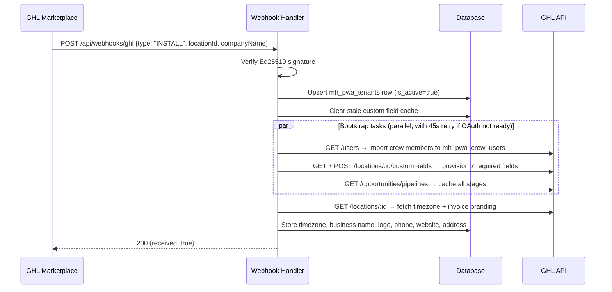
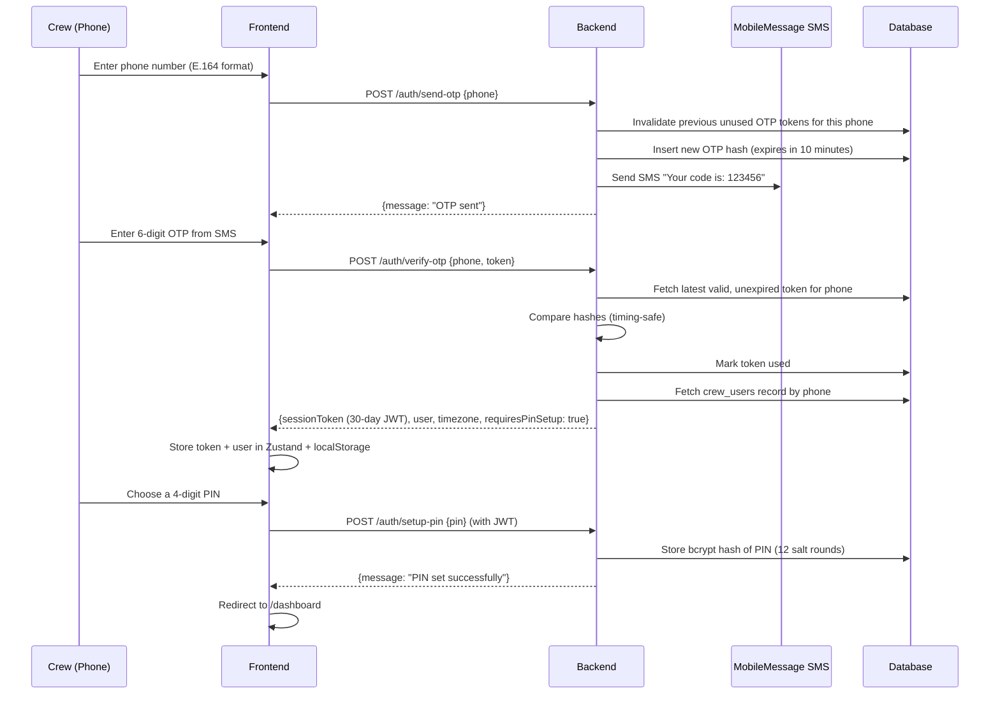
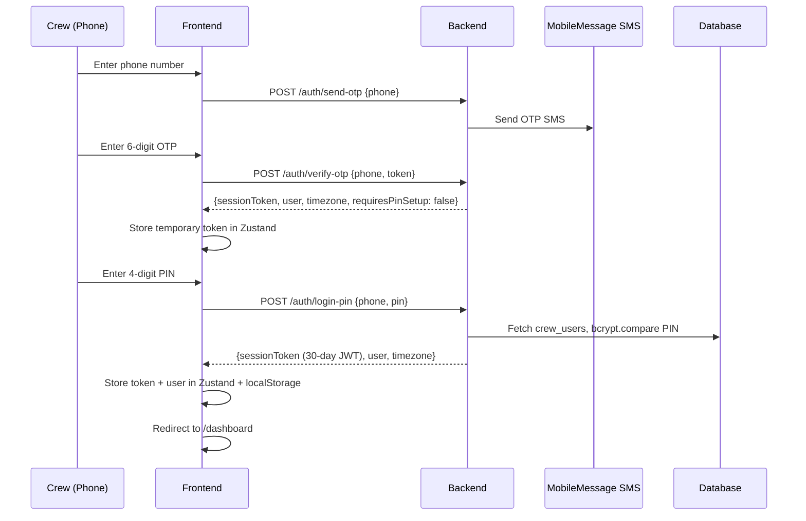
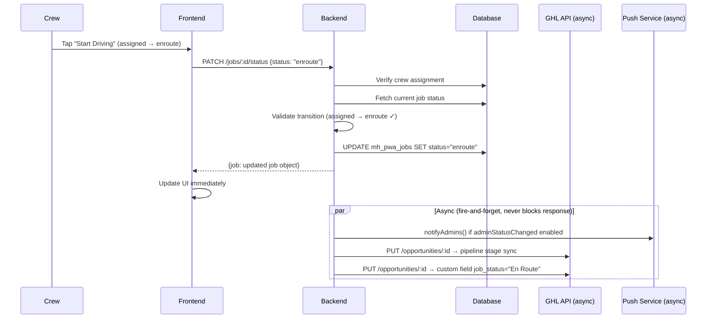
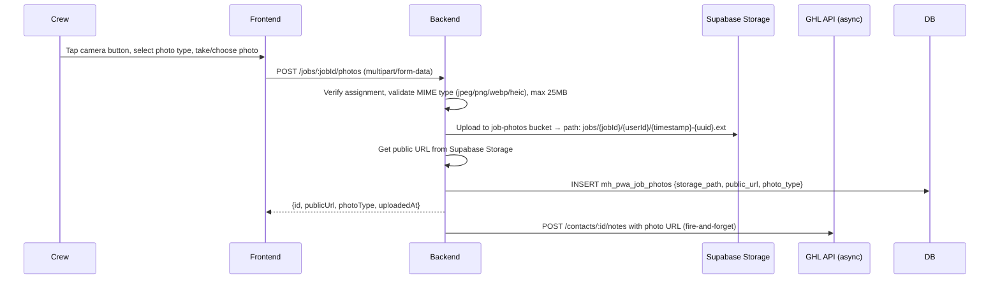
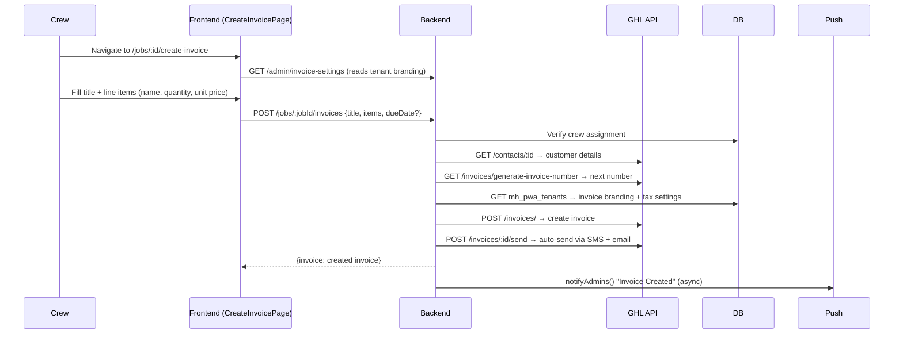
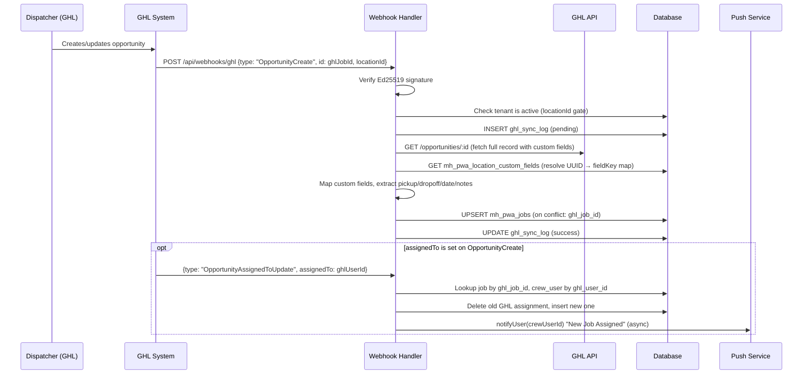
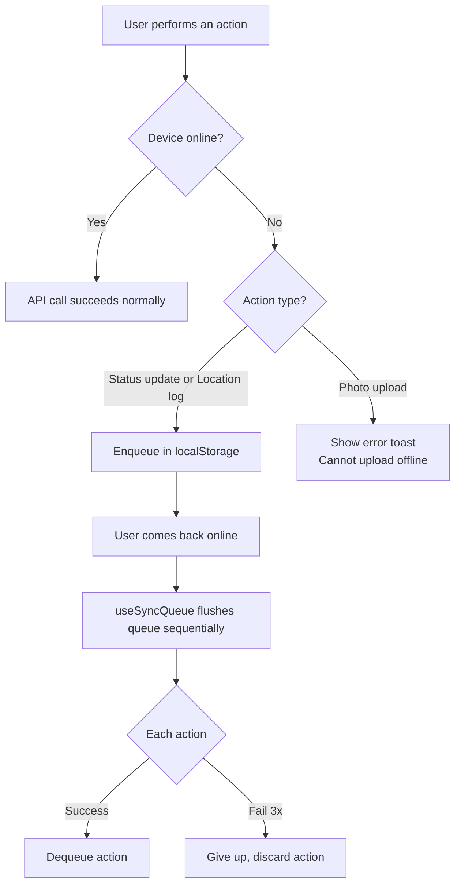

# End-to-End Application Flow

This document traces the complete lifecycle of the application — from installation through every major user journey. Follow these flows to understand how the system behaves at each step.

---

## 1. App Installation (GHL Marketplace)

When a removalist company installs the app from the GHL Marketplace, GHL fires an `INSTALL` webhook. This single event bootstraps the entire tenant.



**What gets created:**
- One `mh_pwa_tenants` row — the tenant is now active
- One `mh_pwa_crew_users` row per GHL user who has a phone number
- 7 custom fields on GHL opportunities (if they didn't exist): Pickup Address, Dropoff Address, Scheduled Date, Item Summary, Crew Notes, Job Status, Job Type
- All pipeline stages cached in `mh_pwa_pipeline_stages`

The company can start using the app immediately after install.

---

## 2. Crew Authentication

Crew members never register — their accounts are created automatically from GHL user data. Login is phone-based with a two-step flow.

### First Login (OTP → PIN setup)



### Subsequent Logins (OTP → PIN)

The current frontend UI always requires OTP verification before PIN entry — PIN is a second factor, not a standalone login. The flow is the same as first login up to the OTP step, then redirects to PIN entry instead of PIN setup.



**JWT payload:** `{ userId, phone, role, locationId }` — valid for 30 days. The token is stored in both Zustand state and `localStorage.mh_token`. On 401 from any API call, the frontend clears stored credentials and redirects to login.

---

## 3. Crew Job Lifecycle

This is the core daily workflow for a crew member.

### 3.1 Dashboard — Viewing Jobs

On login, the crew member lands on the dashboard. The app fetches their assigned jobs:

1. Backend queries `mh_pwa_job_crew_assignments` for all `job_id` values belonging to this `crew_user_id`
2. Then queries `mh_pwa_jobs` for those IDs, scoped to the tenant's `location_id`
3. **Upcoming tab:** jobs not yet completed or cancelled, ordered by `scheduled_date` ascending
4. **History tab:** completed and cancelled jobs, ordered by `updated_at` descending (last 15)

Jobs are grouped by date (Today / Tomorrow / specific date) on the Upcoming tab.

The service worker caches job list and individual job responses using a NetworkFirst strategy — if the server is unreachable, the last cached response is shown.

### 3.2 Job Detail — Progressing Through Status

The crew member taps a job card to open the detail view. Status transitions are enforced in strict order:

```
assigned → enroute → arrived → in_progress → completed
     ↓         ↓         ↓            ↓
  cancelled cancelled  cancelled   cancelled
```

Each status change:



**On `completed`:** the backend also calculates duration (from `scheduled_date` to now in minutes) and pushes it to GHL opportunity description along with `status: "won"`.

**On `cancelled`:** the backend pushes `status: "lost"` to GHL with the cancellation reason.

**GPS snapshot on status change:** when status changes to `enroute` or `arrived`, the frontend captures the device GPS position and logs it via `POST /jobs/:jobId/locations`. This snapshot is stored in `mh_pwa_job_locations` and is visible to admins on the crew map.

### 3.3 Maps Navigation

The job detail page provides one-tap navigation links:
- **To Pickup:** opens Google Maps with the crew's current location as origin and the pickup address as destination
- **To Dropoff:** opens Google Maps with pickup as origin and dropoff as destination

### 3.4 Timesheet (Clock In / Clock Out)

Crew members track their time per job. The TimeTracker component manages the full clock-in/out flow:

```
Crew taps "Clock In"
  → POST /jobs/:jobId/timesheets/clock-in
  → DB: INSERT mh_pwa_timesheets {job_id, crew_user_id, clock_in=now()}
  → Returns 409 if already clocked in

Crew takes a break → enters break duration → taps "End Break"
  → POST /jobs/:jobId/timesheets/break-end {breakMinutes}
  → DB: UPDATE break_minutes += breakMinutes on active timesheet

Crew taps "Clock Out"
  → POST /jobs/:jobId/timesheets/clock-out {breakMinutes?}
  → DB: UPDATE mh_pwa_timesheets SET clock_out=now(), break_minutes+=breakMinutes
  → DB auto-calculates total_minutes = elapsed_minutes - break_minutes (generated column)
```

Multiple clock-in/out sessions per job are supported (a crew member may clock out and back in for the same job).

### 3.5 Photo Capture

Crew members can capture and upload photos categorised as: before, after, damage, item, or other.



**Offline behaviour:** photo uploads are not queued offline. If the device has no internet, an error is shown immediately. Binary data cannot be stored in localStorage (the offline queue backing store).

---

## 4. Invoice Workflow

Crew members can create and send invoices directly from the job detail page without leaving the field.

### 4.1 Create a New Invoice



Invoices are always auto-sent to the customer immediately after creation. The crew never needs to manually send.

### 4.2 Convert an Estimate to an Invoice

If the dispatcher created a quote/estimate in GHL before the job, the crew can convert it to a billable invoice:

```
Crew opens job detail → views Estimates section
  → GET /jobs/:jobId/estimates → GHL returns estimate list for the contact
  → Crew taps "Convert to Invoice" on an accepted estimate
  → POST /jobs/:jobId/invoices/from-estimate {estimateId}
  → Backend: PUT estimate → set estimateStatus="accepted" (auto-accept)
  → Backend: POST /invoices/estimate/:id/invoice → convert
  → Backend: POST /invoices/:newId/send → auto-send
```

### 4.3 Record a Manual Payment

For cash or bank transfer payments collected on-site:

```
Crew taps "Record Payment" → enters amount + optional notes
  → POST /jobs/:jobId/invoices/:invoiceId/record-payment {amount, notes}
  → GHL: POST /invoices/:id/record-payment {amount, paymentMethod: "manual"}
  → Admin notified via push notification
```

---

## 5. Admin Workflows

Admin users see everything their crew members see, plus an admin panel accessible at `/admin`.

### 5.1 Initial Setup (One-Time)

After install, an admin completes a one-time setup:

1. **Pipeline setup** (`/admin/pipeline`) — select which GHL pipeline to track. The backend fetches all pipelines from GHL and the admin picks one.
2. **Stage mapping** (`/admin/stages`) — map GHL pipeline stages to app job statuses (assigned, enroute, arrived, in_progress, completed, cancelled). This drives automatic pipeline stage updates when crew advance jobs.
3. **Invoice settings** (`/admin/invoice-settings`) — configure business name, logo URL, phone, website, address, tax settings, and invoice number prefix.
4. **Notification settings** (`/admin/notification-settings`) — toggle which events trigger push notifications.

### 5.2 Daily Operations

**Jobs overview** (`/admin/jobs`) — admin can see all active jobs for the location, their current status, customer name, addresses, and assigned crew.

**Crew map** (`/admin/crew-map`) — shows the last known GPS snapshot for each active crew member on a Leaflet map. Snapshots are recorded on status changes (enroute, arrived). This is not live tracking — it reflects the crew member's position when they last changed status.

**Crew management** (`/admin/crew`) — view all crew members, their role, and active status. Admins can toggle crew active/inactive and change roles.

### 5.3 Sync Operations

If GHL data gets out of sync, the admin panel provides manual sync buttons:

| Button | Action |
|---|---|
| Sync Jobs | Fetches open opportunities from GHL and upserts them into `mh_pwa_jobs` |
| Sync Crew | Fetches GHL users and upserts them into `mh_pwa_crew_users` |
| Sync Stages | Re-fetches pipeline stages from GHL |
| Sync Location | Re-fetches location info (timezone, invoice branding) |
| Refresh Fields | Clears custom field UUID cache — forces a fresh fetch on next webhook |
| Provision Fields | Creates any missing required custom fields on GHL |

---

## 6. Job Sync from GHL (Inbound)

Every time a dispatcher creates or modifies an opportunity in GHL, the app receives a webhook and syncs the data.



**Custom field resolution:** GHL webhooks only contain scalar fields. The handler always fetches the full opportunity from the GHL API to get custom fields (pickup address, dropoff address, scheduled date, etc.). Custom field UUIDs are resolved to human-readable keys via a DB-cached map that refreshes daily.

---

## 7. Offline Behaviour

The app is designed to remain usable without internet connectivity.



The service worker also serves cached responses when the server is unreachable:
- Job list and individual job details are cached with a 24-hour max age (NetworkFirst: tries network first, falls back to cache after 10 seconds)
- Images are cached for 7 days (CacheFirst)
- All app pages are available from the precache (built at deploy time)

---

## 8. Push Notifications

Push notifications use the Web Push API (VAPID). The service worker receives push events and shows system notifications even when the app is not open.

**Subscription flow:**
1. On first dashboard load, the app prompts crew members to allow notifications
2. On approval, `navigator.serviceWorker.ready` is used to get a push subscription object
3. The subscription is sent to `POST /notifications/subscribe` and stored in `mh_pwa_push_subscriptions`
4. The VAPID public key is fetched from `GET /notifications/vapid-key`

**Notification events:**

| Event | Recipient | Trigger |
|---|---|---|
| New Job Assigned | Crew member | `OpportunityAssignedToUpdate` webhook processed |
| Job Status Update | All admins | Crew updates job status |
| Invoice Created | All admins | Crew creates an invoice |
| Invoice Sent | All admins | Crew sends an invoice |
| Invoice Deleted | All admins | Crew deletes a draft invoice |
| Payment Recorded | All admins | Crew records a payment |

All of these are configurable — each can be toggled independently in Admin → Notification Settings.

Tapping a notification navigates to a relevant URL (e.g., `/admin/jobs` for admin notifications, `/jobs/:id` for crew job assignment).

Expired push subscriptions (HTTP 410/404 from the push service) are automatically removed from the database.

---

## 9. App Updates (PWA)

The service worker handles app updates automatically. When a new version is deployed:

1. The browser downloads the new service worker in the background
2. It waits because the old service worker is still active
3. The new SW calls `skipWaiting()` immediately on install
4. The app detects the new SW has taken control and shows an `UpdateBanner` at the top of the screen
5. When the user taps "Reload", the page refreshes and the new version activates

This ensures crew members always eventually get the latest version without it being forced on them mid-job.

---

## 10. Uninstall

When a company uninstalls the app from GHL:

```
GHL fires: {type: "UNINSTALL", locationId}
  → Backend: UPDATE mh_pwa_tenants SET is_active=false, uninstalled_at=now()
  → All data preserved in the database
  → Tenant validation gate blocks all future webhooks for this locationId
```

If the company reinstalls later, the `INSTALL` event reactivates the tenant row (`is_active=true`, `uninstalled_at=null`) and re-runs the bootstrap process.
