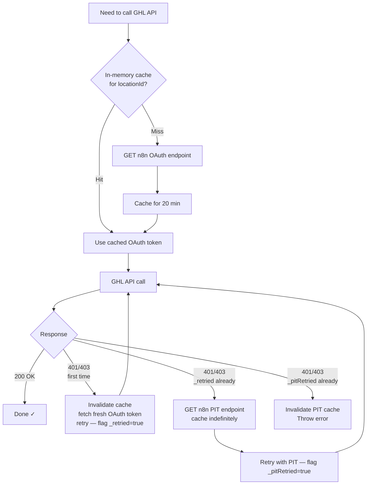
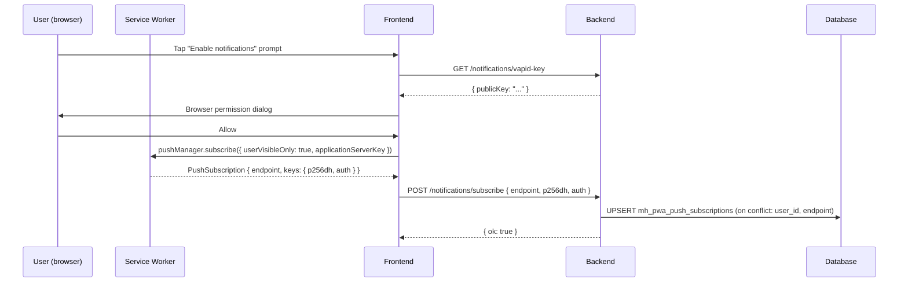

# Integrations

This document covers every external system the app communicates with — what it is, how the connection works, what data moves across it, and what can go wrong.

---

## 1. GoHighLevel (GHL)

GHL is the central CRM that the app wraps. It is the authoritative source for jobs, contacts, pipeline data, invoices, and estimates. The app never creates data in isolation — everything originates from or is synced back to GHL.

### 1.1 What GHL Provides

| GHL Entity | Maps To |
|---|---|
| Sub-account (`locationId`) | Tenant |
| User | Crew member |
| Opportunity | Job |
| Opportunity custom fields | Job details (pickup, dropoff, date, notes, type) |
| Pipeline + stages | Job status workflow |
| Contact | Customer linked to a job |
| Invoice | Invoice created and sent on-site |
| Estimate | Pre-job quote that can be converted to an invoice |

### 1.2 Inbound: GHL Webhooks

GHL sends webhook events to `POST /api/webhooks/ghl` for every relevant action in the CRM.

**Signature verification:** Every request is verified with an Ed25519 digital signature. GHL signs the raw request body with its private key and sends the signature in the `X-GHL-Signature` header (Base64-encoded). The app verifies it against the GHL app's public key (`GHL_WEBHOOK_PUBLIC_KEY` env var). Requests that fail verification are rejected with 401.

The webhook route is registered **before** `express.json()` so the raw request body buffer is preserved for signature verification. A custom `captureRawBody` middleware captures it as `req.rawBody` then parses it into `req.body`.

**Tenant gate:** After signature verification, every event (except `INSTALL`) is checked against `mh_pwa_tenants`. Events from unknown or inactive `location_id` values return 200 but are silently skipped — this prevents processing stale data from uninstalled tenants.

**All handled events:**

| Event | Description |
|---|---|
| `INSTALL` / `AppInstall` | Register or reactivate tenant; run bootstrap (crew, fields, stages) |
| `UNINSTALL` / `AppUninstall` | Soft-deactivate tenant; preserve all data |
| `PLAN_CHANGE` / `PlanChange` | Update `plan_id` on tenant |
| `LocationUpdate` | Sync company name change (uses `body.id`, not `body.locationId`) |
| `OpportunityCreate` | Fetch full opportunity, upsert job; also process assignment if present |
| `OpportunityUpdate` | Re-fetch and upsert job |
| `OpportunityStageUpdate` | Re-fetch and upsert job (may change status via stage name mapping) |
| `OpportunityStatusUpdate` | Map GHL `won → completed`, `lost → cancelled` |
| `OpportunityAssignedToUpdate` | Update crew assignment, notify crew member via push |
| `OpportunityDelete` | Mark job cancelled |
| `UserCreate` / `UserUpdate` | Upsert crew member (phone is login identifier) |
| `UserDelete` | Soft-disable crew member |

All webhook events are logged to `mh_pwa_ghl_sync_log` (`direction: inbound`) with their final status.

**Why webhooks always return 200:** GHL retries events that receive non-2xx responses. For non-transient failures (bugs, missing data), the app logs the failure and returns 200 anyway so GHL doesn't retry indefinitely.

### 1.3 Outbound: GHL API Calls

The app makes REST calls to the GHL API (`https://services.leadconnectorhq.com`) for:

| Purpose | Endpoint |
|---|---|
| Fetch full opportunity | `GET /opportunities/:id` |
| List opportunities (admin sync) | `GET /opportunities/search` |
| Update opportunity (status, stage, custom fields) | `PUT /opportunities/:id` |
| List pipelines | `GET /opportunities/pipelines` |
| Fetch users | `GET /users/?locationId=` |
| Fetch location info | `GET /locations/:id` |
| Fetch/create custom fields | `GET/POST /locations/:id/customFields` |
| Fetch contact | `GET /contacts/:id` |
| Add contact note (photo URL) | `POST /contacts/:id/notes` |
| List invoices | `GET /invoices/` |
| Create invoice | `POST /invoices/` |
| Send invoice | `POST /invoices/:id/send` |
| Delete invoice | `DELETE /invoices/` |
| Generate invoice number | `GET /invoices/generate-invoice-number` |
| Record payment | `POST /invoices/:id/record-payment` |
| List estimates | `GET /invoices/estimate/list` |
| Accept estimate | `PUT /invoices/estimate/:id` |
| Convert estimate to invoice | `POST /invoices/estimate/:id/invoice` |

**API version:** All requests send `Version: 2021-07-28`. Estimates endpoints require `Version: 2023-02-21` specifically.

**Retry logic:** All outbound calls that modify GHL data use `retryWithBackoff` — 3 attempts, starting at 500ms with exponential backoff (500ms → 1000ms → 2000ms).

**Fire-and-forget pattern:** Status updates, stage syncs, custom field updates, and photo URL pushes are made asynchronously after the user-facing response is already sent. If they fail, the error is logged to `mh_pwa_ghl_sync_log` but the user never sees it.

### 1.4 Custom Field System

GHL stores opportunity custom fields with UUIDs, not human-readable names. The app maintains a local cache to resolve UUIDs to field keys.

```
mh_pwa_location_custom_fields
  field_id  → UUID from GHL (e.g. "abc123-...")
  field_key → human key (e.g. "opportunity.pickup_address")
  updated_at → used to detect staleness (refreshes daily)
```

When a webhook arrives, the handler fetches the full opportunity and resolves its `customFields: [{ id, fieldValue }]` array by looking up each UUID in this cache. If the cache is missing or stale (> 1 day), it refreshes from `GET /locations/:id/customFields`.

**Required custom fields:** The app auto-provisions 7 custom fields on install and via the admin "Provision Fields" button:

| Field Name | Key | Type |
|---|---|---|
| Pickup Address | `opportunity.pickup_address` | TEXT |
| Dropoff Address | `opportunity.dropoff_address` | TEXT |
| Scheduled Date | `opportunity.scheduled_date` | TEXT |
| Moving Inventory | `opportunity.moving_inventory` | LARGE_TEXT |
| Crew Notes | `opportunity.crew_notes` | LARGE_TEXT |
| Job Status | `opportunity.job_status` | TEXT |
| Job Type | `opportunity.job_type` | DROPDOWN (Door to Door / Depot to Depot / Quote) |

### 1.5 Stage → Status Mapping

GHL pipeline stage names are mapped to app job statuses via a canonical lookup table (`stageStatusMap.js`). The mapping is case-insensitive and trims whitespace:

| Stage Name | Job Status |
|---|---|
| new, lead, booked, confirmed | `assigned` |
| en route | `enroute` |
| on site | `arrived` |
| in progress, active | `in_progress` |
| completed, done, won | `completed` |
| cancelled, lost | `cancelled` |

The admin configures which pipeline to watch via the admin panel. Custom stage names that don't match this table are ignored (status not updated).

### 1.6 Invoice and Estimate API Quirks

Documented here because they differ from what GHL's own docs suggest:

- **Invoice amounts:** amounts are in dollars, not cents (despite docs suggesting cents)
- **Invoice identifier:** use `altId`/`altType: "location"` (not `locationId`) in all invoice API calls
- **Invoice line items field:** use `items` (not `invoiceItems`)
- **Estimates API version:** must send `Version: 2023-02-21` header (different from the global default)
- **Estimate status field:** `estimateStatus` (not `status`)
- **Estimate expiry field:** `expiryDate` (not `expiry`)
- **Estimate number fields:** `estimateNumber` + `estimateNumberPrefix` (not `number`)
- **Estimate conversion:** estimate must be `accepted` before conversion — the app auto-accepts silently before calling the convert endpoint

---

## 2. n8n (Token Management)

n8n is a workflow automation platform used exclusively to manage GHL OAuth tokens. The app never handles GHL's OAuth flow directly — n8n owns the access tokens and the app fetches them on demand.

### 2.1 OAuth Token Endpoint

```
GET {N8N_TOKEN_ENDPOINT}?location_id={locationId}&app_id={appId}
Response: { access_token: "eyJ..." }
```

The app calls this endpoint whenever it needs to talk to GHL and has no valid cached token. The n8n workflow handles the OAuth 2.0 token lifecycle (storage, refresh, expiry) invisibly.

**Caching:** Tokens are cached in-memory per `location_id` for 20 minutes. This avoids hammering n8n on every GHL call. A process restart clears the cache — the first call after restart will hit n8n.

### 2.2 PIT Token Endpoint

```
GET https://n8n.app.systree.com.au/webhook/get-pit-token?location_id={locationId}&pit_name={GHL_PIT_NAME}
Response: { pit: "pit_..." }
```

The Private Integration Token (PIT) is a long-lived fallback used when OAuth fails. Unlike the OAuth token (20-minute cache), PITs are cached indefinitely in memory and only evicted when a GHL API call using the PIT still returns 401/403.

**When the PIT is used:** Only after two consecutive 401/403 failures with the OAuth token (once with cached token, once with a freshly fetched token). It is the last resort before the GHL call fails entirely.

### 2.3 Three-Stage Auth Flow



---

## 3. Supabase

Supabase provides two services: PostgreSQL (primary data store) and Storage (photo files).

### 3.1 PostgreSQL

**Connection:** The backend uses the `@supabase/supabase-js` client with the **service role key** (`SUPABASE_SERVICE_KEY`). This key bypasses all Row Level Security (RLS) policies — the app enforces tenant isolation at the application layer, not via RLS. The client has `autoRefreshToken: false` and `persistSession: false` (server-side, no session management needed).

**Usage pattern:** All database access goes through the Supabase JS client. No raw SQL is used in application code (only in migration files). Queries are chainable builder-style:
```js
supabase.from('mh_pwa_jobs').select('*').eq('location_id', locationId).eq('id', jobId)
```

**Migrations:** Schema changes are managed as sequential numbered SQL files in `backend/supabase/migrations/` (currently 001–020). They are applied manually with `psql $DATABASE_URL < file.sql`. The next migration is `021_*`.

### 3.2 Storage

**Bucket:** `job-photos` (must be set to public in the Supabase dashboard).

**Path format:** `jobs/{jobId}/{crewUserId}/{timestamp}-{uuid}.{ext}`

**Upload:** Files are uploaded as binary buffers (`req.file.buffer` from Multer in-memory storage). The MIME type and file size (25 MB max) are validated before upload.

**Public URL:** After upload, `supabase.storage.from('job-photos').getPublicUrl(storagePath)` returns a permanent public URL. This URL is stored in `mh_pwa_job_photos.public_url` and pushed to GHL as a contact note.

**Delete:** On photo delete, the app removes the file from Storage first, then removes the DB record. If the Storage delete fails, the error is logged but the DB record is still removed (the file becomes an orphan — this is an accepted trade-off).

**Supported formats:** JPEG, PNG, WebP, HEIC, HEIF (validated by MIME type, not file extension).

---

## 4. MobileMessage (SMS)

MobileMessage is the SMS gateway used to send OTP codes during login.

**Endpoint:** `POST https://api.mobilemessage.com.au/v3/sms`

**Authentication:** Bearer token (`MOBILEMESSAGE_API_KEY` env var)

**Payload:**
```json
{
  "recipients": ["+61412345678"],
  "message": "Your Mover Hero verification code is: 123456. Valid for 10 minutes.",
  "from": "MoverHero"
}
```

The `from` field (sender ID) is configurable via `MOBILEMESSAGE_SENDER_ID` (default: `MoverHero`).

**When SMS is skipped:** Phone numbers listed in the `OTP_BYPASS_PHONES` env var (comma-separated, E.164 format) always receive OTP `123456` without an SMS. The OTP is logged to the console instead. This is intended for development and testing.

**Error handling:** SMS sending failures throw an error that propagates to the `sendOtp` controller, which returns a 500 to the frontend. There is no SMS retry logic — if the MobileMessage call fails, the user must request a new OTP.

---

## 5. Web Push API (VAPID)

Push notifications are delivered via the browser's Web Push API using VAPID (Voluntary Application Server Identification). This is a standard W3C protocol — no third-party push service is involved.

### 5.1 VAPID Setup

VAPID keys are generated once with `npx web-push generate-vapid-keys` and stored as env vars:
- `VAPID_PUBLIC_KEY` — shared with the frontend so browsers can subscribe
- `VAPID_PRIVATE_KEY` — used by the server to sign push requests (never leaves the server)
- `VAPID_SUBJECT` — contact URL or mailto, e.g. `mailto:admin@moverhero.com.au`

### 5.2 Subscription Lifecycle



One user can have multiple active subscriptions (one per device/browser). The `endpoint` is the unique identifier per subscription.

### 5.3 Sending Notifications

The `pushService.js` module provides two functions:

- **`notifyUser(userId, payload)`** — finds all subscriptions for a user, sends to all devices in parallel
- **`notifyAdmins(locationId, payload)`** — finds all admin users for the tenant, sends to all their subscriptions in parallel

Both are fire-and-forget — they never throw or block. Failures are logged.

**Payload shape:**
```json
{
  "title": "New Job Assigned",
  "body": "You have been assigned a job for John Smith on Mon 16 Jun",
  "url": "/jobs/abc123",
  "tag": "job-assigned-abc123"
}
```

The service worker's `push` event handler receives this payload and calls `showNotification()`. Clicking the notification navigates to `payload.url` (default: `/dashboard`).

### 5.4 Subscription Cleanup

When a push delivery returns HTTP 410 (Gone) or 404, the subscription has expired or been revoked by the browser. The `sendToSubscription` function returns `null` in this case, and the caller (`notifyUser` / `notifyAdmins`) deletes the subscription from `mh_pwa_push_subscriptions` automatically.

Users can also manually unsubscribe from the Profile page, which calls `DELETE /notifications/subscribe` with the endpoint. All subscriptions for a user are removed on logout via `DELETE /notifications/subscriptions`.

---

## 6. Workbox / PWA

The frontend is a Progressive Web App built with Vite + `vite-plugin-pwa`. Workbox provides the service worker infrastructure.

### 6.1 Build Mode

The plugin uses `injectManifest` strategy — the app provides its own service worker source (`src/sw-custom.js`) and Workbox injects the precache manifest at build time. This was chosen over the default `generateSW` mode to allow custom push notification handlers to coexist with Workbox's caching logic.

### 6.2 Precaching

At build time, Workbox generates a manifest of all static assets (`**/*.{js,css,html,ico,png,svg,woff2}`). The service worker precaches these on install, so the entire app shell is available offline from the first visit.

### 6.3 Runtime Caching Strategies

| Resource | Strategy | Cache Name | TTL | Notes |
|---|---|---|---|---|
| `/api/jobs` (job list) | NetworkFirst | `jobs-cache` | 24h, max 10 entries | 10s network timeout |
| `/api/jobs/:id` (individual jobs) | NetworkFirst | `jobs-cache` | 24h, max 200 entries | 10s network timeout |
| All other `/api/*` | NetworkFirst | `api-cache` | 24h, max 100 entries | 10s network timeout |
| Images | CacheFirst | `image-cache` | 7 days, max 50 entries | Serves from cache without checking network |
| SPA navigation (non-API) | Precache handler | — | — | Always serves `index.html` from precache |

### 6.4 Auto-Update

The plugin is configured with `registerType: 'autoUpdate'`. When a new build is deployed:
1. The browser downloads the new service worker
2. The new SW calls `self.skipWaiting()` immediately on `install`
3. On `activate`, it claims all open clients
4. The `UpdateBanner` React component detects the new SW has taken control and prompts the user to reload

### 6.5 Development

The PWA service worker is disabled in development (`devOptions: { enabled: false }`). The Vite dev server proxies `/api` requests to `http://localhost:8000` (the backend dev server).

---

## Environment Variable Reference

All integration points are configured via environment variables. Below is the complete list with their purpose:

| Variable | Integration | Purpose |
|---|---|---|
| `SUPABASE_URL` | Supabase | Project URL |
| `SUPABASE_SERVICE_KEY` | Supabase | Service role key (bypasses RLS) |
| `GHL_API_BASE_URL` | GHL | Base URL (default: `https://services.leadconnectorhq.com`) |
| `GHL_APP_ID` | GHL / n8n | Marketplace app ID — passed to n8n token endpoint |
| `GHL_WEBHOOK_PUBLIC_KEY` | GHL | Ed25519 public key for webhook signature verification |
| `N8N_TOKEN_ENDPOINT` | n8n | URL of the OAuth token webhook |
| `GHL_PIT_NAME` | n8n / GHL | Name of the Private Integration Token to fetch as fallback |
| `JWT_SECRET` | Auth | Secret for signing/verifying session JWTs |
| `MOBILEMESSAGE_API_KEY` | MobileMessage | API key for SMS sending |
| `MOBILEMESSAGE_SENDER_ID` | MobileMessage | Sender name shown on SMS (default: `MoverHero`) |
| `OTP_BYPASS_PHONES` | Auth | Comma-separated phones that skip SMS (dev only) |
| `VAPID_PUBLIC_KEY` | Web Push | VAPID public key shared with browsers |
| `VAPID_PRIVATE_KEY` | Web Push | VAPID private key for signing push requests |
| `VAPID_SUBJECT` | Web Push | Contact identifier for push service (mailto or https) |
| `FRONTEND_URL` | CORS | Allowed origin in production |
| `PORT` | Server | HTTP port (default: 3001) |
| `VITE_API_URL` | Frontend | Backend API base URL (read at build time) |
