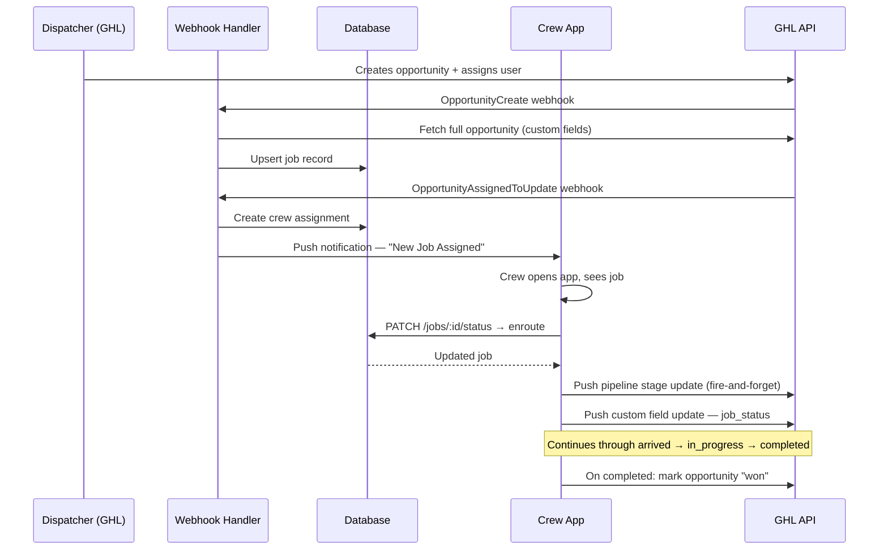

# System Overview

## What is Mover Hero Crew App?

Mover Hero Crew App is a Progressive Web App (PWA) built for removalist (moving) companies. It connects field crew members with jobs dispatched from GoHighLevel (GHL), the company's CRM platform.

The app exists as a GHL Marketplace application. When a removalist company installs it from the GHL Marketplace, the system automatically registers that company as a tenant, imports their staff as crew members, and begins syncing job data in real time.

---

## Who Uses It?

There are two types of users:

**Crew members** — the field workers who perform the moves. They use the app on their phones to:
- See jobs assigned to them
- Update job status as the move progresses (En Route → Arrived → In Progress → Completed)
- Clock in and out for timesheet tracking
- Capture photos (before/after, damage, items)
- Create and send invoices to customers
- Record customer payments

**Admins** — the dispatchers or managers who run the business. They use the admin panel to:
- View all active jobs across the company
- Manage and reassign crew members
- Configure which GHL pipeline and stages map to job statuses
- Manage invoice branding and billing rules
- View last known crew locations on a map
- Configure which push notification events are enabled

---

## Core Concept: Jobs Come From GHL

The app does not create jobs independently. Every job originates in GHL as an **Opportunity**. When a dispatcher creates or updates an opportunity in GHL, GHL fires a webhook to the app, which syncs the data into the local database and makes it visible to the assigned crew member.

When crew members update job status in the app, those changes are pushed back to GHL automatically — updating the opportunity status, moving it through the pipeline, and updating custom fields.

This means **GHL is always the system of record for job and customer data**. The app provides the mobile interface for the field team.

---

## Multi-Tenancy

The system is fully multi-tenant. Each removalist company that installs the app is an isolated tenant, identified by their GHL `location_id`. Every database query is scoped to a `location_id`, so companies cannot see each other's data.

A single deployment of this app can serve many companies simultaneously.

---

## Key Capabilities

| Capability | Description |
|---|---|
| SMS OTP + PIN login | Crew log in with their phone number. No email or password. |
| PWA install | App installs on crew phones like a native app. Works offline. |
| Real-time job sync | Jobs flow from GHL to the app via webhooks instantly. |
| Status updates → GHL | Crew status changes sync back to GHL opportunities automatically. |
| Timesheets | Clock-in/clock-out per job with break tracking and auto-calculated totals. |
| Photo capture | Crew upload before/after and damage photos from the job site. |
| Invoice creation | Crew can create, send, and record payment for GHL invoices on-site. |
| Estimates → Invoices | Existing GHL estimates can be converted to invoices from the app. |
| Push notifications | Crew notified on job assignment; admins notified on status changes. |
| Crew location map | Status changes snapshot GPS location, visible to admins on a map. |
| Offline support | App works without internet. Actions queue and sync on reconnection. |

---

## Technology at a Glance

| Layer | Technology |
|---|---|
| Frontend | React 18 + Vite, PWA via Workbox |
| Backend | Node.js + Express |
| Database | Supabase (PostgreSQL) |
| Auth | Custom OTP (MobileMessage SMS) + bcrypt PIN + JWT |
| GHL tokens | n8n webhook (OAuth access token management) |
| Push notifications | Web Push API (VAPID) |
| Photo storage | Supabase Storage |
| GHL integration | GoHighLevel REST API v2021-07-28 |

---

## How a Job Flows Through the System

